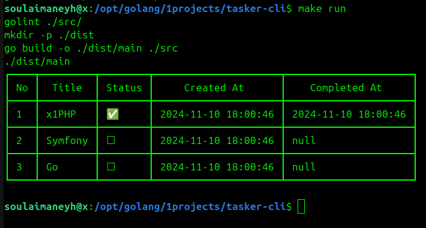

# Tasker CLI



CLI Todo App written in Go

## Installation

- Clone the repository:

```shell
git clone https://github.com/soulaimaneyahya/tasker-cli.git
```

### Usage

1. Compile tasker-cli:

```sh
go mod init tasker-cli && go mod tidy
```

```sh
go fmt ./src/*.go
```

```sh
make build
```

```sh
make run
```

```sh
make clean
```

## Contributing

Contributions are welcome! If you find any issues or have suggestions for improvements, please open an issue or submit a pull request.

## x1

- Go does not support unions like `time.Time | nil` directly. Instead, to represent an optional `time.Time` is by using a pointer (`*time.Time`)

- %+v is especially helpful for debugging, as it provides both the field names and values in the output.

----- 
Need helps? Reach me out

> Email: soulaimaneyahya1@gmail.com

All the best :beer:
